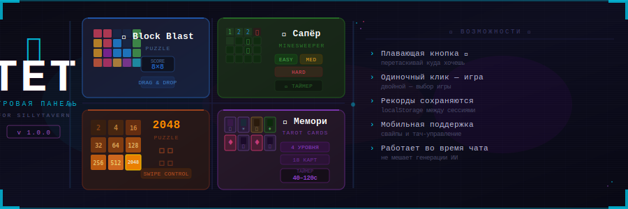

# 🎮 TET — Игровая Панель для SillyTavern



>  мини-игры прямо в интерфейсе SillyTavern — играй пока ИИ думает!

---

## ✨ Что это такое

**TET** — расширение для [SillyTavern](https://github.com/SillyTavern/SillyTavern), которое добавляет плавающую игровую кнопку с встроенными мини-играми. Кнопку можно перетаскивать в любое место экрана — она не мешает чату и не отвлекает от общения с ИИ.

---

## 🕹️ Игры

### ⬛ Block Blast
Классический тетрис-пазл! Перетаскивай фигуры на поле 8×8, заполняй ряды и столбцы, чтобы их очистить. Зарабатывай очки и бей свои рекорды.

- Поле 8×8 клеток
- 3 случайные фигуры за раз
- Очистка рядов и столбцов даёт бонус
- Рекорд сохраняется между сессиями

---

### 💣 Сапёр
Классический Сапёр с тремя уровнями сложности. Открывай клетки, расставляй флажки и находи все мины!

| Уровень | Сетка | Мины |
|---------|-------|------|
| Easy    | 9×9   | 10   |
| Medium  | 9×9   | 15   |
| Hard    | 9×9   | 20   |

- **Клик** — открыть клетку
- **ПКМ / долгое нажатие** — поставить флажок 🚩
- Мины расставляются после первого клика — первый ход всегда безопасен
- Рекорд времени для каждой сложности сохраняется

---

### 🔢 2048
Всемирно известная головоломка — складывай плитки, добирайся до 2048!

- Управление свайпами
- Рекорд сохраняется между сессиями
- Экран победы при достижении 2048

---

### 🃏 Мемори (Карты Таро)
Найди все пары карт Таро! Переворачивай карты, запоминай их положение и собирай все пары до истечения времени.

| Уровень | Пары | Время | Сетка |
|---------|------|-------|-------|
| 1       | 2    | 40с   | 2×2   |
| 2       | 4    | 60с   | 2×4   |
| 3       | 6    | 90с   | 3×4   |
| 4+      | 8    | 120с  | 4×4   |

В игре используются 18 карт Таро: Смерть, Император, Императрица, Справедливость, Солнце, Дьявол, Шут, Повешенный, Отшельник, Жрица, Влюблённые, Луна, Звезда, Башня, Мир, Колесо Фортуны.

- Уровень прогрессирует автоматически
- Рекорд времени для каждого уровня сохраняется
- При проигрыше можно повторить уровень

---

## 📦 Установка

### Способ 1 — через интерфейс SillyTavern (рекомендуется)

1. Открой SillyTavern
2. Перейди в **Extensions → Install Extension**
3. Введи URL репозитория и нажми **Install**

### Способ 2 — вручную

1. Скачай или клонируй этот репозиторий
2. Скопируй папку `tet` в директорию расширений SillyTavern:
   ```
   SillyTavern/public/scripts/extensions/third-party/tet
   ```
3. Перезагрузи SillyTavern
4. Включи расширение в меню **Extensions**

---

## 🚀 Как пользоваться

После установки на экране появится плавающая кнопка 🎮:

| Действие | Результат |
|----------|-----------|
| **Одиночный клик** | Открыть / закрыть текущую игру |
| **Двойной клик** | Открыть выбор игры |
| **Перетаскивание** | Переместить кнопку в удобное место |

Положение кнопки и текущая выбранная игра сохраняются между сессиями.

---

## 💾 Сохранение данных

Все данные хранятся в `localStorage` браузера:

- `bb_best` — рекорд Block Blast
- `bb_game` — последняя выбранная игра
- `bb_btnpos` — позиция кнопки
- `ms_diff` — сложность Сапёра
- `ms_best_easy/medium/hard` — рекорды Сапёра по сложности
- `g2048_best` — рекорд 2048
- `mem_level` — текущий уровень Мемори
- `mem_best` — рекорды Мемори по уровням

---

## 🗂️ Структура файлов

```
tet/
├── index.js          # Основная логика всех игр
├── style.css         # Стили панели и игровых элементов
├── manifest.json     # Манифест расширения
└── images/
    ├── back.png              # Рубашка карты Таро
    ├── death.jpg             # Смерть
    ├── emperor.jpg           # Император
    ├── empress.jpg           # Императрица
    ├── justice.jpg           # Справедливость
    ├── sun.jpg               # Солнце
    ├── the_devil.jpg         # Дьявол
    ├── the_fool.jpg          # Шут
    ├── the_fool_2v.jpg       # Шут (вариант 2)
    ├── the_hanged_man.jpg    # Повешенный
    ├── the_hermit.jpg        # Отшельник
    ├── the_high_priestess.jpg # Жрица
    ├── the_lovers.jpg        # Влюблённые
    ├── the_lovers_2v.jpg     # Влюблённые (вариант 2)
    ├── the_moon.jpg          # Луна
    ├── the_star.jpg          # Звезда
    ├── the_tower.jpg         # Башня
    ├── the_world.jpg         # Мир
    └── wheel_of_fortune.jpg  # Колесо Фортуны
```

---

## 🔧 Совместимость

- **SillyTavern** — последние версии
- Все современные браузеры (Chrome, Firefox, Edge, Safari)
- Поддержка мобильных устройств (тач-управление)
